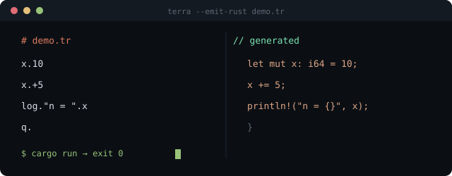

<div align="center">

<picture>
  <source media="(prefers-color-scheme: dark)" srcset="docs/logo-dark.svg" />
  
</picture>

<p>


</p>

</div>

A tiny transpiled scripting language. One-line programs compile to native Rust
binaries: terra reads a `.tr` script, emits equivalent Rust, and hands it to
`cargo`. No VM, no interpreter — the output is plain rust.

<div align="center">

</div>

---

## synopsis

```console
$ cargo run -- script.tr              # compile & run
$ cargo run -- script.tr --emit-rust  # show generated rust only
$ cargo test                          # run the test suite
```

## grammar

Every line is `<verb>.<operand>`. Comments start with `#`.
Statements may also be joined with `;` — a whole program fits on one line.
Values are integers (i64).

| line | meaning |
|---|---|
| `x.10` | assign an integer (declares on first use) |
| `x.y` | copy another variable |
| `x.+5` `x.-5` `x.*5` `x./5` `x.%5` | modify in place |
| `x.+score` | the part after the sign may be a variable too |
| `msg."text"` | string variables work too |
| `log.msg` | print a string variable |
| `at.row.col."text"` | move the cursor and print (rows/columns may be variables) |
| `key.k.` | wait for one keypress; k becomes its byte code || `log."text"` | print text |
| `log.x` | print value |
| `log."text".x` | print text followed by value |
| `in.x` | read an integer from stdin |
| `ask."text".x` | print prompt without newline, then read an integer into x |
| `rnd.x.100` | x becomes a random whole number in 0..100 |
| `cls.` | clear the terminal (ANSI escape) |
| `w.500` | sleep 500 ms |
| `q.` | exit |
| `:name` | define a label |
| `j.name` | jump to label |
| `jeq.x.5.name` | jump if x == 5 — also `jne` `jlt` `jgt` `jle` `jge`; rhs may be a variable |

Reserved words: `log`, `in`, `w`, `q`, `j`, `jeq`...`jge`.
Negative literals: `x.-5` declares -5 on a fresh variable, subtracts 5 from
an existing one.

## example

```text
# demo.tr
log."enter a number:"
in.x
log."you typed ".x
x.+15
y.x
y.*2
log."doubled = ".y
```

The same program after transpilation:

```rust
fn main() {
    println!("enter a number:");
    let mut x: i64 = { /* stdin read + parse */ };
    println!("you typed {}", x);
    x = x + 15;
    let mut y: i64 = x;
    y = y * 2;
    println!("doubled = {}", y);
}
```

Running it:

```console
$ terra_compiler demo.tr
enter a number:
7
you typed 7
doubled = 44
```

Errors are caught before anything is built:

```console
$ terra_compiler bad.tr
terra: error: line 1: missing operand for 'z'
terra: error: line 2: unknown variable 'zz'
terra: 2 error(s), nothing built
```

## loops

Labels and conditional jumps compile to a state machine, so backward
jumps just work — this is a full countdown:

```text
# countdown.tr
i.3
:top
log."t minus ".i
i.-1
jgt.i.0.top      # while i > 0 go back to :top
log."liftoff"
q.
```

```console
$ terra_compiler countdown.tr
t minus 3
t minus 2
t minus 1
liftoff
```

More under [examples/](examples/): `guess.tr` is a number-guessing game,
`snake.tr` is a full snake — cursor positioning, single-key input, growing
body, apples and two endings, in ~180 lines of pure terra.

## pipeline

1. each line is validated against the grammar; undeclared variables are
   rejected at this stage with line numbers
2. accepted lines are translated to rust statements (`let mut` on first
   assignment, plain assignment afterwards)
3. generated code is written to `terra_build/` and executed via `cargo run`

---

<div align="center">

<sub>terra — no vm, no interpreter, just rust.</sub>

</div>
